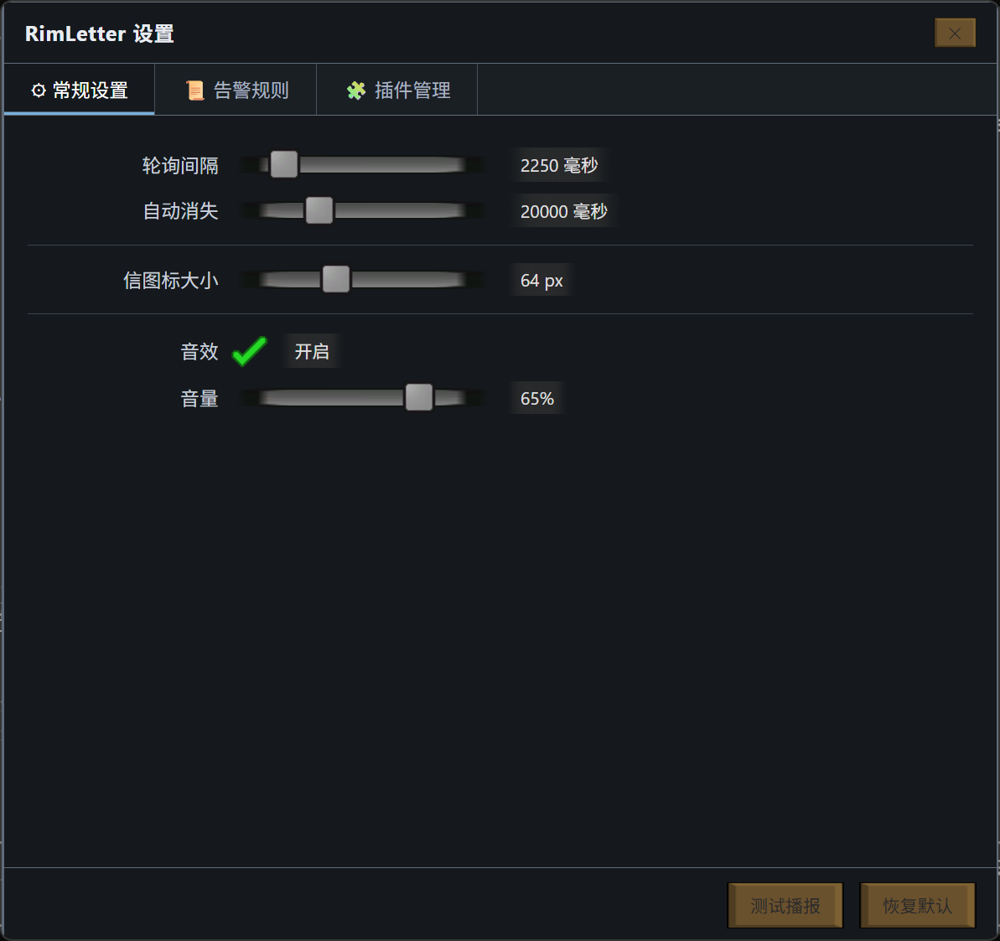

# RimLetter 边缘信使

**⬇️ 下载最新版**

**Windows（NSIS 安装程序）**

- **x64（推荐）**：[GitHub Release 下载](https://github.com/NothingCooker/rimletter/releases/latest/download/RimLetter-Setup-x64.exe) · [中国大陆加速下载](https://ghproxy.net/https://github.com/NothingCooker/rimletter/releases/latest/download/RimLetter-Setup-x64.exe)
- **ARM64**：[GitHub Release 下载](https://github.com/NothingCooker/rimletter/releases/latest/download/RimLetter-Setup-arm64.exe) · [加速下载](https://ghproxy.net/https://github.com/NothingCooker/rimletter/releases/latest/download/RimLetter-Setup-arm64.exe)
- **x86（32 位）**：[GitHub Release 下载](https://github.com/NothingCooker/rimletter/releases/latest/download/RimLetter-Setup-ia32.exe)

**Linux（AppImage / deb）**

- **AppImage x86_64**：[GitHub Release 下载](https://github.com/NothingCooker/rimletter/releases/latest/download/RimLetter-x86_64.AppImage)（下载后 `chmod +x` 直接运行，支持自动更新）
- **AppImage ARM64**：[GitHub Release 下载](https://github.com/NothingCooker/rimletter/releases/latest/download/RimLetter-arm64.AppImage)
- **deb x64（Debian/Ubuntu）**：[下载](https://github.com/NothingCooker/rimletter/releases/latest/download/RimLetter-amd64.deb)（`sudo dpkg -i RimLetter-amd64.deb` 安装）
- **deb arm64**：[下载](https://github.com/NothingCooker/rimletter/releases/latest/download/RimLetter-arm64.deb)

> 加速链接走 ghproxy.net 公益镜像（备选 gh-proxy.com）。Windows 安装包内置自动更新，启动后按当前系统架构自动匹配对应安装包（x64/ia32 读 `latest.yml`，arm64 读 `latest-arm64.yml`）；Linux 仅 **AppImage 支持自动更新**（读 `latest-linux.yml` / `latest-linux-arm64.yml`），deb 包更新请重新下载安装。

一个参考《边缘世界》(RimWorld) 右侧 Letter 信件播报系统的桌面功能性摆件。当硬件占用过高（CPU / 内存 / 磁盘 / GPU）时，信从屏幕右缘坠落滑入提醒；平时完全隐身，告警才出现。全程使用游戏解包的原始 UI 素材与配色，并支持本地 HTTP API 和手写 JS 插件扩展。
官方插件仓库：https://github.com/NothingCooker/rimletter-official-plugins
## 截图

告警播报（右侧信堆栈，按紧急度染色 + 全屏径向闪光 + 威胁弹跳）：


设置窗口（完全参考环世界 UI，深灰蓝窗口 + 米色按钮，含常规 / 告警规则 / 插件管理三个页签）：



## 特性

- 全屏透明悬浮层，平时隐身，告警才出现；鼠标默认穿透，仅信区域可交互
- 信的滑入坠落、全屏径向闪光、威胁弹跳、标题居中于图标并允许溢出，均还原游戏原版行为
- 五种紧急度配色（取自游戏 LetterDefs）：
  - ThreatBig 重大威胁 - 红
  - ThreatSmall 威胁 - 橙红
  - NegativeEvent 负面 - 黄
  - NeutralEvent 中性 - 灰蓝
  - PositiveEvent 正面（恢复正常）- 蓝
- 可扩展规则引擎：传感器 + 指标 + 比较符 + 阈值 + 持续时长 + 紧急度，含去重与恢复播报
- GPU 温度/占用（传感器 GPU（NVIDIA））：NVIDIA 直读（nvidia-smi）；AMD 显卡装官方插件 amd-gpu-stats（LibreHardwareMonitor 数据源，插件市场可装）
- 本地 HTTP API：任何程序可触发播报、读写规则（token 鉴权）
- 插件系统：手写 JS，注册自定义传感器 / 规则 / 主动播报
- 游戏原声音效（提取自游戏 FMOD 音频）
- 托盘图标：单击打开设置；设置窗无边框自绘 UI 但可像真窗口一样拖动（标题栏拖动、双击最大化/还原、边缘吸附），置顶可在托盘菜单开关

## 运行

需要 Node.js 24+ 与 Python 3（仅素材提取需要 Python）。

```bash
# 安装依赖（electron 二进制会通过 npmmirror 镜像下载）
npm install

# 启动
npm start

# 运行测试
npm test

# 提取素材（若 assets 目录缺失时运行）
python scripts/extract_assets.py
```

首次启动后，托盘会出现 RimLetter 图标。单击打开设置窗口。

## 打包安装包

本地打包：

```bash
npm run build
```

产物在 `dist/` 目录（Windows：NSIS 安装程序；Linux：AppImage + deb，各含 x64/arm64）。GitHub Actions 已在 `.github/workflows/build.yml` 中配置自动编译，推送到仓库后自动产出 Windows 与 Linux 安装包（在 Actions 的 Artifacts 中下载）。

## 配置

配置文件位于 `%APPDATA%\rimletter\config.json`（Windows）/ `~/.config/rimletter/config.json`（Linux），也可以在设置窗口调整：

- 轮询间隔、自动消失时长
- 信图标大小、信弹出位置（新信出现在已有信的上方/下方/左侧/右侧 + 横向/纵向边距上限 2000 + 信间距）
- 音效开关与音量
- 告警规则（增删改、启停）

## Linux 注意事项

- **推荐 X11 会话**：透明悬浮层/置顶/点击穿透在 X11（带合成器的桌面环境，KDE/GNOME/Xfce 等默认均有）下工作正常；**Wayland 会话为部分支持**（窗口位置不受应用控制、点击穿透依赖合成器实现），如遇异常请切回 X11 会话（登录界面选择 "Xorg"）。
- **托盘图标**：Linux 托盘依赖桌面环境的 StatusNotifier/AppIndicator 支持；GNOME 需安装 "AppIndicator and KStatusNotifierItem Support" 扩展。
- **开机自启**：写入 XDG autostart（`~/.config/autostart/rimletter.desktop`），设置窗开关即可。
- **GPU 监控**：仅 NVIDIA（nvidia-smi 直读）。AMD 官方插件 amd-gpu-stats 依赖 LibreHardwareMonitor，**仅支持 Windows**，Linux 上暂不可用。
- **磁盘规则**：按真实块设备挂载点（`/`、`/home` 等）逐一判定，自动排除 loop/zram/网络盘等伪或非本地文件系统。

## HTTP API

本地服务默认运行在 `http://127.0.0.1:17301`，仅绑定本机。所有请求需带请求头 `X-RimLetter-Token`，token 见 config.json。

| 方法 | 路径 | 说明 |
|---|---|---|
| GET | /health | 存活检查 |
| POST | /letter | 触发播报 `{severity, title, description, sound?}` |
| GET | /state | 各传感器实时值 |
| GET | /rules | 读取规则 |
| POST | /rules | 新增规则 |
| PUT | /rules/:id | 修改规则 |
| DELETE | /rules/:id | 删除规则 |
| POST | /reload | 重载配置与插件 |

示例：

```bash
curl -X POST http://127.0.0.1:17301/letter \
  -H "X-RimLetter-Token: <token>" \
  -H "Content-Type: application/json" \
  -d '{"severity":"ThreatSmall","title":"构建完成","description":"CI 产物已生成"}'
```

## 插件开发

插件是插件目录下的一个 `.js` 文件（Windows：`%APPDATA%\rimletter\plugins\`；Linux：`~/.config/rimletter/plugins/`），导出 `async ({ api, logger }) => {}`。可注册自定义传感器（自动出现在规则下拉中）、注册规则、主动触发播报、订阅事件、定时任务，以及声明配置表单。

### 插件 API

| API | 说明 |
|---|---|
| `api.registerSensor(name, fn)` | 注册自定义传感器，自动出现在规则引擎下拉 |
| `api.registerRule(rule)` | 注册规则（结构同内置规则） |
| `api.letter({severity, title, description, sound})` | 主动触发一封播报 |
| `api.on(event, handler)` | 订阅事件：alert / recovered |
| `api.getState()` | 读取当前全部传感器实时值 |
| `api.setInterval(fn, ms)` | 定时器，应用退出自动清理 |
| `api.registerConfig({title, fields})` | 声明配置表单（text/number/bool/select/slider/button 六种字段），在 设置→插件管理→配置 内编辑 |
| `api.getConfig()` | 读取当前插件配置（默认值已合并） |
| `api.registerAction(action, fn)` | 注册配置表单 button 字段的动作，返回的字符串显示在按钮旁 |
| `logger.info/warn/error(...)` | 带插件名前缀的日志 |

### 示例

```js
module.exports = async ({ api, logger }) => {
  api.registerSensor('myApp', async () => ({ value: 42 }));
  api.registerRule({
    sensor: 'myApp', metric: 'value', operator: '>', threshold: 40,
    severity: 'NegativeEvent', label: '超载', description: '...', sound: 'auto', enabled: true
  });
  // 配置表单（text/number/bool/select/slider/button 六种字段）
  api.registerConfig({ title: '示例', fields: [
    { key: 'url', label: '地址', type: 'text' },
    { key: 'test', label: '测试', type: 'button', buttonText: '点我' }
  ] });
  api.registerAction('test', async () => '按钮点击结果（显示在按钮旁）');
  api.letter({ severity: 'PositiveEvent', title: '你好', description: '插件主动播报' });
  logger.info('插件已加载');
};
```

完整 API 参考见设置窗口 - 插件管理 - 插件开发文档。官方插件仓库：https://github.com/NothingCooker/rimletter-official-plugins

## 素材说明

应用使用到的纹理与音效提取自用户自有的《边缘世界》(RimWorld) 游戏安装目录（`scripts/extract_assets.py` 为提取管线）。这些素材版权归 Ludeon Studios 所有，本项目仅供学习与个人使用，请勿用于商业用途或再分发游戏原始素材。

## 许可证

代码部分：MIT License。游戏素材版权归 Ludeon Studios 所有（见上）。
